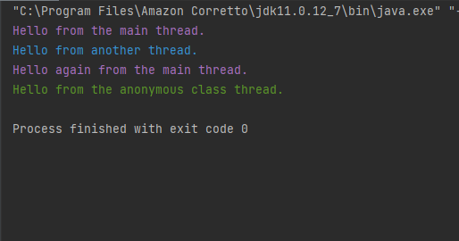

# Threads
basic code showing multiple threads being printed to the consol. Runnable, Interrupt and Join methods on these threads. 
 * depending on your machine and operating system, each time you run the code, the console may print out the messages in different order.

